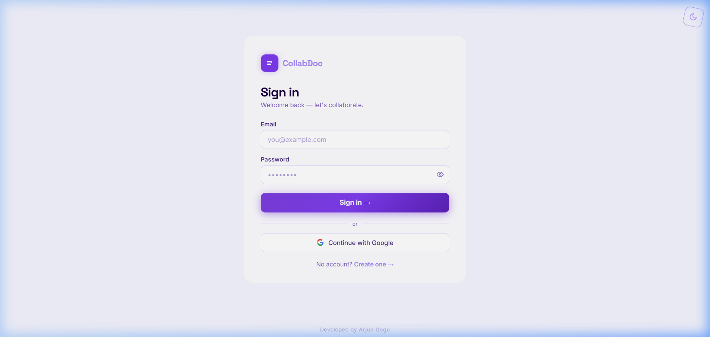
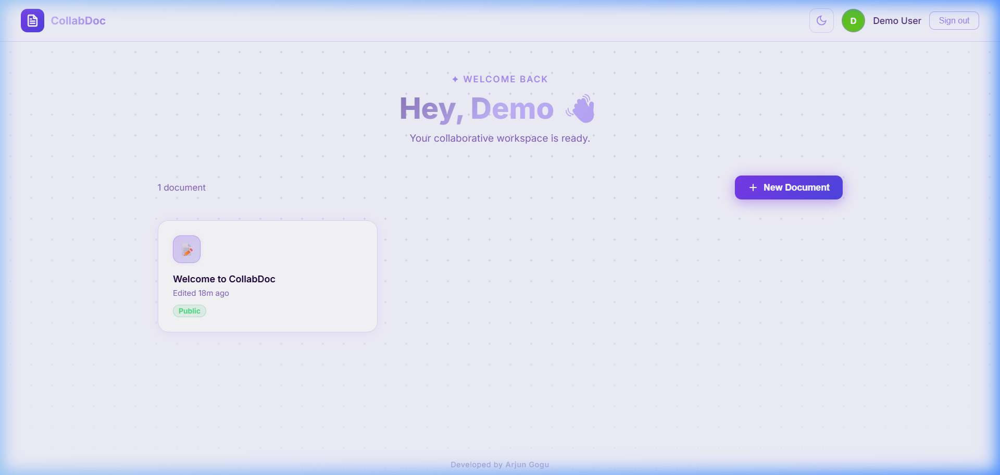
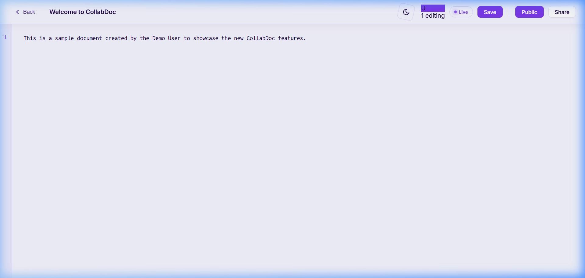

# 📝 CollabDoc — Real-time Collaborative Workspace

[](https://vercel.com)
[](https://render.com)
[](https://yjs.dev)

**CollabDoc** is a full-stack real-time collaborative document editor. Built with the MERN stack and powered by **Yjs CRDTs**, it provides a seamless experience with conflict-free editing and live presence.

---

## ✨ Features

- 🔐 **Secure Auth**: JWT-based authentication.
- 🚀 **Real-time Sync**: Instant synchronization using Yjs and WebSockets.
- 👥 **Live Presence**: See who's currently editing.
- 🌓 **Dynamic Themes**: Light and Dark modes.
- 📝 **Markdown Support**: Support for markdown syntax.

---

## 📸 Screenshots

<p align="center">
  
  
</p>

<p align="center">
  
</p>

---

## 🛠️ Tech Stack

- **Frontend:** React.js, Vite, CodeMirror 6, Yjs
- **Backend:** Node.js, Express, Socket.io, MongoDB, Yjs

---

## 🚀 Quick Start

### 1. Installation
```bash
cd backend && npm install
cd ../frontend && npm install
```

### 2. Running the App
```bash
# Terminal 1: Backend
cd backend && npm run dev

# Terminal 2: Frontend
cd frontend && npm run dev
```

---

## 🧠 Technical Highlights

- **CRDT (Yjs):** Ensures eventual consistency without central coordination.
- **Persistence:** Document state stored as binary in MongoDB.

---

## 👨‍💻 Developed by [Arjun Gogu](https://github.com/Arjun-coder-ops)
