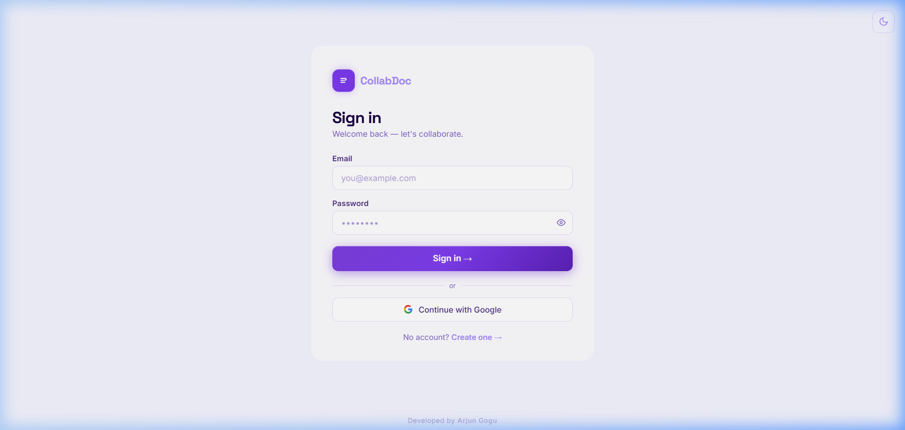
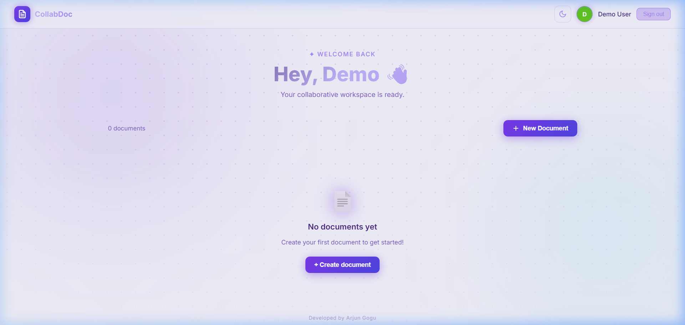
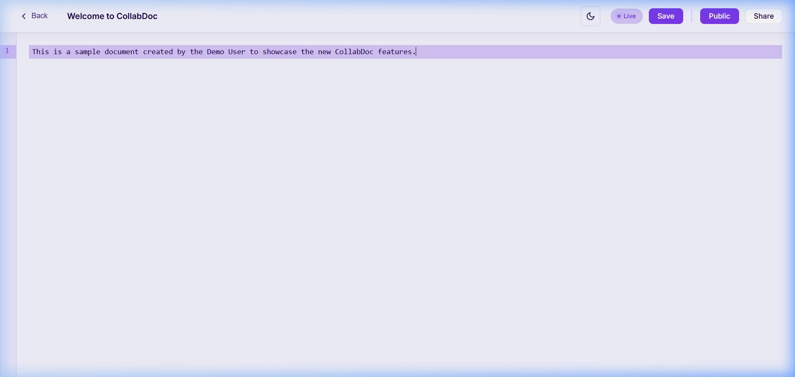

# 📝 CollabDoc — Real-time Collaborative Workspace

[](https://vercel.com)
[](https://render.com)
[](https://yjs.dev)
[](https://opensource.org/licenses/MIT)

**CollabDoc** is a premium, full-stack real-time collaborative document editor. Built with the MERN stack and powered by **Yjs CRDTs**, it provides a seamless "Google Docs" experience with conflict-free editing, live presence, and a stunning glassmorphism UI.

---

## ✨ Features

- 🔐 **Secure Auth**: JWT-based authentication with Google Sign-In support.
- 🚀 **Real-time Sync**: Instant synchronization across all users using Yjs and WebSockets.
- 👥 **Live Presence**: Interactive avatars show who's currently editing.
- 🌓 **Dynamic Themes**: Seamless switching between stunning Light and Dark modes.
- 📝 **Markdown Ready**: Full support for markdown syntax with a professional CodeMirror 6 editor.
- 💾 **Auto-Save**: Background persistence to MongoDB ensuring zero data loss.
- 🔗 **Shareable links**: Toggle document visibility between Public and Private.

---

## 📸 Screenshots

<p align="center">
  
  
</p>
<p align="center">
  
</p>

---

## 🎬 Live Demo

Experience the fluid collaboration and theme switching in this short walkthrough:


---

## 🛠️ Tech Stack

### Frontend
- **Framework:** React.js + Vite
- **Styling:** Vanilla CSS (Glassmorphism + Modern Gradients)
- **Editor:** CodeMirror 6
- **Collaboration:** Yjs + y-codemirror.next

### Backend
- **Server:** Node.js + Express
- **Real-time:** Socket.io
- **Database:** MongoDB + Mongoose
- **Engine:** Yjs (CRDT for conflict resolution)

---

## 🚀 Quick Start

### 1. Prerequisites
- Node.js (v18+)
- MongoDB Atlas account

### 2. Installation
```bash
# Clone the repository
git clone https://github.com/Arjun-coder-ops/collabdoc.git
cd collabdoc

# Install dependencies
cd backend && npm install
cd ../frontend && npm install
```

### 3. Environment Setup
Create a `.env` file in the `backend` folder:
```env
PORT=5000
MONGO_URI=your_mongodb_connection_string
JWT_SECRET=your_super_secret_key
CLIENT_URL=http://localhost:5173
```

Create a `.env` file in the `frontend` folder:
```env
VITE_API_URL=http://localhost:5000
```

### 4. Running the App
```bash
# Terminal 1: Backend
cd backend && npm run dev

# Terminal 2: Frontend
cd frontend && npm run dev
```

---

## 🧠 Technical Deep Dive

### Why Yjs over Operation Transformation (OT)?
Traditional OT (used by Google Docs) requires a central server to coordinate and transform every single operation. **Yjs (CRDT)** allows for a decentralized approach where every edit is treated as a unique logical event. This guarantees that all users will eventually see the exact same document state without complex server-side conflicts.

### Persistence Strategy
The document state is stored as a binary blob in MongoDB. Every 2 seconds (or on manual save), the Yjs state is debounced and persisted, allowing for efficient "hydration" upon page refresh.

---

## 👨‍💻 Developed by [Arjun Gogu](https://github.com/Arjun-coder-ops)

If you like this project, feel free to give it a ⭐!
